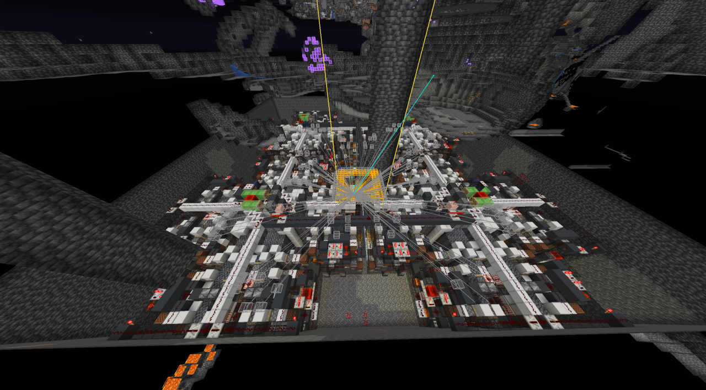
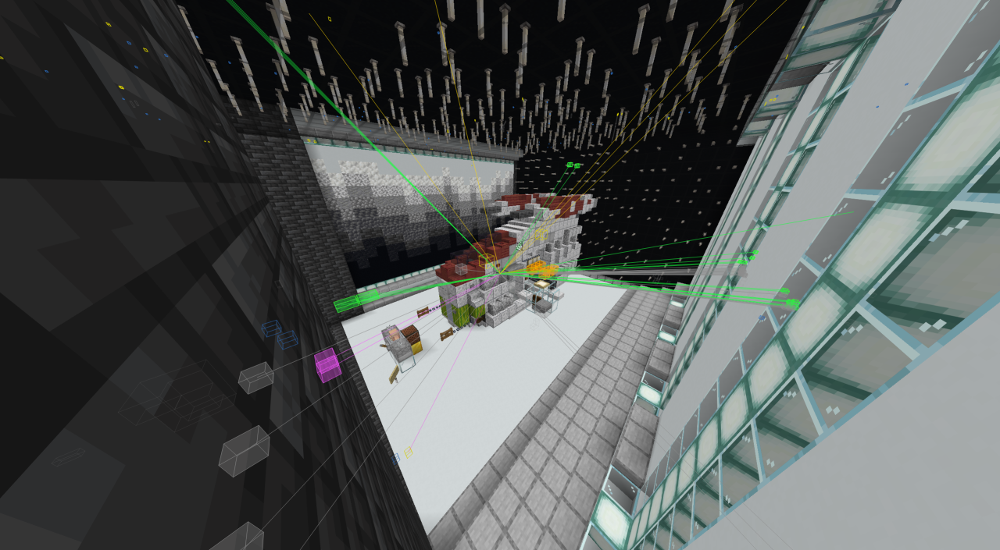
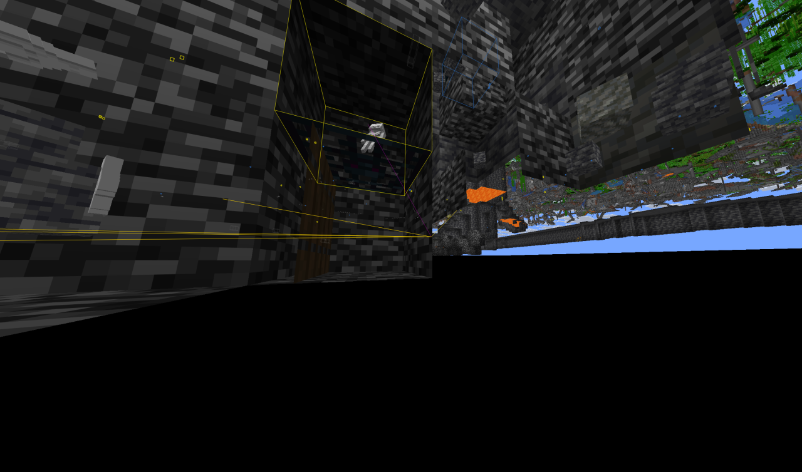

# Gamma

A client-side Fabric mod for Minecraft Java Edition focused on rendering, world visualization,
and base/stash finding.



<sub>StorageESP and tracers through solid rock: every chest, barrel and shulker in a buried complex,
sorted by container type, before breaking a single block.</sub>

> **Using this on a multiplayer server is very likely against that server's rules.** ESP, X-ray and
> Freecam are visible-advantage mods on essentially every server regardless of how they're
> implemented, and the DonutSMP group below is written against one specific server's mechanics.
> Nothing here is an anticheat bypass or an automation tool, but that distinction is not one most
> server rules make. Gamma is built for single-player, private servers you administer, and servers
> that explicitly allow client-side visual mods. Check before you use it.

## Install

Requires **Minecraft 26.2**, **Java 25**, **Fabric Loader 0.19.3+** and **Fabric API**.

Download the jar from the [Releases](../../releases) page and drop it in your `mods/` folder. You
do not need to build it yourself. SQLite is bundled in the jar, so there is no native driver to
install.

## Modules

Opened with the ClickGUI (default <kbd>Right Shift</kbd>, rebindable in settings), or
`.toggle <module>` in chat. Full command reference: `.help` in-game.

**Render** — Xray, Fullbright, NoRender (granular toggles for fog, rain, snow, screen overlays,
hurt cam, view bobbing, armor and more), Ambience (custom sky/fog/weather), Zoom, Freecam,
Freelook, ViewModel, BlockHighlight, Trajectories, Chams, Tracers, NameTag.

**ESP** — EntityESP, PlayerESP (nametags, health, armor, ping), ItemESP, StorageESP (chests,
barrels, shulkers, hoppers, furnaces — the core base-finding tool), BlockESP (arbitrary block list
with incremental scanning), LogoutSpots (tracks where players vanish), Breadcrumbs (player trails).

**World** — NewChunks (new-chunk detection via a pluggable classifier pipeline, see
`docs/CLASSIFIERS.md`), StashFinder (automatic stash scoring across the logged chunk database),
Waypoints (per-server, per-dimension, Overworld/Nether conversion, Xaero and Lunar import).

**Base Hunting** — modules that exist specifically to find other people's builds: SusChunkFinder
(chunks whose underground contains blocks that don't occur there naturally), CrystalESP, HoleESP,
ElytraFinder (item frames with an elytra in them).

**DonutSMP** — grouped by server rather than by function, because these depend on one server's
specific mechanics and are noise everywhere else: ShardItemTimer, SpawnerFinder, FakeInventory,
RenderDistanceExploit.

**Misc** — AutoReconnect, AutoSign, BetterTooltips (shulker contents, map preview, NBT),
NameProtect (blur your own name for screenshots), FakeCoordinates, ScoreboardEditor, Spotify,
DiscordRPC (off by default).

## Showcase

<table>
<tr>
<td width="50%"></td>
<td width="50%"></td>
</tr>
<tr>
<td><sub>Inside the same kind of build — containers coloured by type, item frames flagged, tracers
running to everything still in range.</sub></td>
<td><sub>Xray and ESP at depth: a single stashed container picked out through untouched deepslate,
with the surface visible above it.</sub></td>
</tr>
</table>

## Other features

- **Account switcher** — real Microsoft OAuth sign-in, reachable from the title screen and the
  server list. Tokens are stored encrypted (AES-256-GCM) under `gamma/`. See
  [Account switcher](#account-switcher) below for what that encryption does and does not protect.
- **ClickGUI** — rounded, animated, with fuzzy search across all categories.
- **HUD** — draggable element editor.
- **Chunk map overlay** — renders the logged chunk database.
- **Per-server config profiles**, plus named configs you can bind to a server address.
- **A bundled example config** — "DonutSMP (Example)", installed into `gamma/configs/` on first
  run and bound to `donutsmp.net`. Load it from the ClickGUI's Configs screen to see a full
  base-hunting setup rather than starting from an empty list. Delete it and it stays deleted.

## Account switcher

Sign-in goes through Microsoft's own endpoints. Gamma never sees a password, and nothing is
imported from another launcher's files.

Two things worth knowing before you use it:

- **The default `MsaClientId` is Mojang's launcher application id.** It works, and it is what most
  third-party launchers use, but it is not Gamma's own registered application. If you would rather
  not sign in through someone else's client id, register your own Azure application and paste its
  id into the `MsaClientId` setting — sign-in then completes in the browser with nothing to paste
  back.
- **Token storage is encrypted, not sealed.** The key is a random 32-byte file next to the token
  store. That protects you if `gamma/accounts.json` alone is copied off the machine; it does not
  protect you against code already running as your user, which can simply read both files. Treat
  `gamma/` as sensitive and don't commit it or share it.

## Building from source

You only need this if you're modifying Gamma. Requires Java 25.

```
./gradlew build
```

The output jar is written to `build/libs/gamma-<version>.jar`. That is the only jar the build
produces — Gamma ships as a mod, not as a library, so there is no sources jar.

## Documentation

- `docs/CLASSIFIERS.md` — the new-chunk classifier pipeline
- `docs/COMPAT.md` — known third-party mod interactions

## License

MIT. See `LICENSE`.
